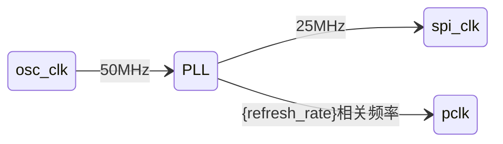
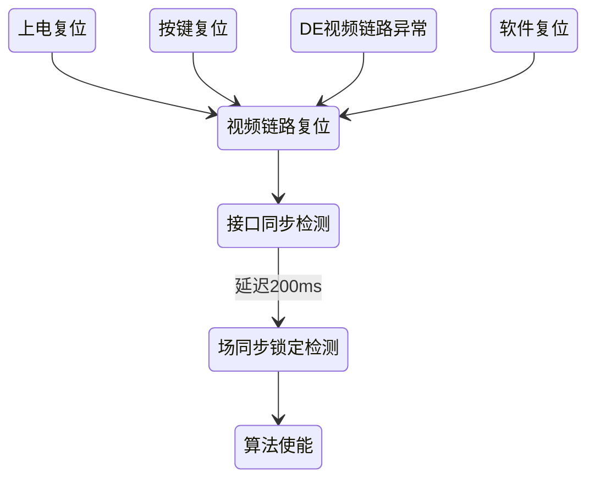

本技术文档面向硬件工程师提供基于 {resolution} 分辨率 {screen_size} 寸显示屏、兼容 {refresh_rate} 帧率、{bit_depth_description}的 Pro 版。本视频增强系统开发指南，涵盖**芯片资源评估**、**算法实现**、**硬件集成**及**寄存器配置**等关键技术模块。设计方案采用 {interface_type} 传输架构，并基于 {fpga_model} FPGA 芯片进行硬件资源评估。

# 1 特性

* 面向综合场景（电竞高刷、视频娱乐、办公），支持手动选择 PQE 算法模式，平衡算法优缺点
{vrr_feature_block}* 支持多种视频增强算法
  * 可选饱和度-颜色提升：采用自然饱和度算法，针对低饱和度区域进行智能补偿
    * 可选肤色保真2.0：人脸检测+肤色分区，避免人脸失真。
  * 可选锐度-清晰度提升：高频边缘强化，提升画面清晰度
  * 可选护眼+色温：降低蓝光对人眼的刺激，减少长时间观影的视觉疲劳
  * 可选CLAHE-DELTA算法-对比度提升：局部对比度增强，突出图像暗处细节
    * 可选肤色保真2.0：人脸检测+肤色分区，避免人脸失真（避免人脸因对比度提升后变暗）。
    * 支持分块纯色保护：内置场景检测机制，可按照分块区域识别纯色/渐变区域，并动态抑制HDR等增强算法，以防止噪声放大和色阶断裂
    * 支持分块灰阶消除：将图像分块，然后**分别计算每个块的灰度程度**，防止对灰色区域进行处理
  * 可选引导滤波：自动识别天空区域、大片纯色区域，降低图像压缩导致的色阶断裂
    * 可选肤色保真2.0：人脸检测+肤色分区，避免人脸失真（避免人脸被平滑，丢失细节）。
{temporal_filter_feature}* 可选新增肤色检测2.1
* 视频增强算法支持无损真直通模式
* 视频增强算法支持左右分屏对比模式
* 兼容 {interface_type}
  * 支持视频切片无缝处理：输入时自动合并所有切片形成完整图像帧，处理后分离输出。设计中采用异步 FIFO 跨时钟域同步及像素级对齐握手协议，解决多通道数据流的异步性问题，保证图像重建的完整性。
  * 支持热插拔：通过看门狗监控视频有效信号的稳定性。当视频信号丢失（如热拔插）时，系统能检测到视频链路中断；当视频链路恢复时，系统将执行看门狗复位流程，确保显示正常恢复
  * 支持上电复位：从电源欠压状态恢复时，系统将执行上电复位。此过程严格遵循视频接口的复位顺序，以确保显示正常
  * 自动视频稳定检测
* 内建视频链路检测错误
* 兼容 {resolution} 分辨率，支持 {refresh_rate} 帧率
* {bit_depth_feature}
{iic_feature_block}* 内建 SPI 从机接口，仅用于研发阶段调试
  * 支持通讯看门狗。通讯异常可选中断和复位
  * 自动CRC校验等通讯错误
{ahb_feature_block}* 支持图像增强对比功能。可选左右分屏分别配置增强和关闭

<div STYLE="page-break-after: always;"></div>

# 2 修订记录

| 版本 | 释放日期 | 描述 |
| :--- | :--- | :--- |
| **V1.0** | {current_date} | 初始版本释放 |

<div STYLE="page-break-after: always;"></div>

# 3 图像增强算法

这一章将会介绍每个图像增强算法模块的算法原理和硬件架构。

## 3.1 自适应饱和度增强

自适应饱和度增强模块是图像处理流水线中的关键一环，旨在智能提升画面色彩表现，同时避免常见的色彩失真问题。该模块包含两大核心功能：饱和度增强和肤色保真。前者负责提升整体画面的色彩鲜艳度，而后者则专注于识别人体肤色区域，确保在色彩增强过程中肤色保持自然、真实。二者协同工作，在增强视觉冲击力的同时，实现了对关键图像内容的精准保护。

### 3.1.1 饱和度增强

<big>**规格点**</big>

*   **{bit_depth_spec_vibrance}**
*   **支持真直通模式:** 模块支持将饱和度增强功能完全关闭，让原始视频数据无损通过。通过将饱和度调整量寄存器 $vibrance\_adjustment$ 配置为0，算法的增强效果被完全抑制，从而实现“真直通”。
*   **支持分屏对比功能:** 内置了用于调试和效果演示的分屏对比模式。在该模式下，屏幕左半边应用增强算法，右半变则保持原始画面。这为实时、直观地评估算法效果提供了极大的便利。
*   **采用自然饱和度算法:** 与相比线性饱和度算法，它能更智能地提升色彩。该算法会优先增强画面中较为暗淡的颜色，而对已经很鲜艳的颜色则处理得较为温和，有效避免了色彩溢出（Clipping）和过饱和问题。
    *   **可配置的增强（连续）程度:** 算法的增强强度（$vibrance\_adjustment$）可通过寄存器灵活配置，允许用户根据内容类型或个人偏好，对色彩增强的程度进行精细调节。
    *   **肤色保护集成:** 算法能够接收并应用来自“肤色保真”模块生成的肤色概率图（Skin Mask）。在进行饱和度增强时，它会降低或完全跳过对肤色区域的处理，确保人脸等部分的色彩在画面整体变得更鲜艳的同时，依然保持自然、真实。

<big>**算法原理**</big>

自然饱和度本质上是维持RGB最大通道的值不变，减少另外两个通道的值，从而拉大该像素点的极差，增大饱和度S。算法步骤如下：

1. 计算近似平均值$I_{avg}=(B_{i,j}+G_{i,j} \times 2 + R_{i,j})/4$
2. 找出最大值$I_{max}=max(B_{i,j},G_{i,j},R_{i,j}$)
3. 根据每个像素点对应调整因子$amt\_val=(I_{max}-I_{avg}) \times vibrance\_adjustment$，其中$vibrance\_adjustment$参数是可以通过寄存器配置的，用于控制饱和度增强的强度。
4. 调整每个颜色通道

$$
\begin{cases}
R'_{i,j}=R_{i,j}+(I_{max}-R_{i,j})\times amt\_val\\
G'_{i,j}=G_{i,j}+(I_{max}-G_{i,j})\times amt\_val\\
B'_{i,j}=B_{i,j}+(I_{max}-B_{i,j})\times amt\_val
\end{cases}
$$

5. 输出新像素$R'G'B'$

<big>**硬件实现**</big>

自然饱和度算法的硬件实现采用了为实时视频处理而优化的高度并行化流水线架构。下图展示了单个视频处理通道（LANE）的数据路径。整个处理流程与像素时钟（`pclk`）同步，确保了高吞吐量。


<small><b>图3.1 自然饱和度硬件实现示意图</b></small>

其核心处理流程分解为以下几个流水线阶段，每个阶段都与算法原理和下表中的硬件单元紧密对应：

1.  **像素分析阶段 ($I_{max}$ 与 $I_{avg}$ 计算):**
    *   使用一个基于多路选择器的比较器逻辑（**U1**），在单周期内计算出三个颜色分量的最大值 $I_{max}$。
    *   同时，通过加法器（**U2**）和硬件移位操作，高效计算出像素的加权平均值 $I_{avg} = (R + 2G + B) / 4$。
2.  **调整因子计算阶段 (`amt_val`):**
    *   首先，一个减法器（**U3**）计算出 $I_{max}$ 与 $I_{avg}$ 的差值。
    *   随后，该差值与一个来自寄存器的全局参数 `vibrance_adjustment` 相乘（由乘法器 **U4** 实现）。
3.  **肤色保护集成阶段:**
    *   在应用前，`amt_val` 会通过一个乘法器（**U8**）使用肤色调节因子 $P$ 进行调制，确保肤色区域增强强度被动态衰减。
4.  **最终颜色通道调整阶段:**
    *   由三个并行的减法器（**U5**）计算通道差值。
    *   该差值乘以调制后的 `amt_val`（由三路并行乘法器 **U6** 完成）。
    *   最后，通过三个并行的加法器（**U7**）加回到原始通道值。

| 符号 | 描述                                         | 参数      | 每LANE个数 | 总个数 |
| ---- | -------------------------------------------- | --------- | ---------- | ------ |
| U1   | 计算R,G,B三通道中的最大值 (I_max)            | 10比特    | 1          | 8      |
| U2   | 用于计算加权平均值 (I_avg) 的加法器          | 10+10     | 3          | 24     |
| U3   | 计算最大值与平均值的差值 (I_max - I_avg)     | 10-10     | 1          | 8      |
| U4   | 计算初始调整因子 (amt_val)                   | 10x8      | 1          | 8      |
| U5   | 计算各颜色通道与最大值的差值 (I_max - R/G/B) | 10-10     | 3          | 24     |
| U6   | 将通道差值与调整因子相乘                     | 10x21     | 3          | 24     |
| U7   | 将调整结果加回原始颜色通道                   | 10+31     | 3          | 24     |
| U8   | 根据肤色概率调制调整因子 (amt_val)           | 3x18      | 1          | 8      |

> [!NOTE]
> **位宽确定依据**
> 1.  **`vibrance_adjustment` (8比特无符号数)**：256级调节足以满足感知精度。
> 2.  **`P` (3比特)**：3比特（0~4级）混合在视觉上已足够避免跳变，同时降低 U8 资源。

### 3.1.2 肤色保真2.0

<big>**规格点**</big>

*   **{bit_depth_spec_skin}**
*   **采用肤色椭圆检测模型**
    *   **基于YCrCb颜色空间的肤色检测:** 在 YCrCb 颜色空间建立椭圆模型。
    *   **输出肤色概率图 (Skin Mask):** 输出与视频流同步的肤色概率图，指导后续模块保护肤色。
    *   **资源共享设计:** 每 2 个 LANE 共享一套硬件模块（包括 ROM 查找表）。

<big>**算法原理**</big>

在 **YCrCb** 颜色空间的色度平面（**Cr 和 Cb**）上建立椭圆模型：`φ(cr, cb)=k*((cr - cr0)² / a² + (cb - cb0)² / b²)`。

硬件实现上采用了基于查找表（LUT）的优化方案。椭圆公式拆分为两部分预存：
*   查找表1: `f(cr) = k * ((cr - cr0)² / a²)`
*   查找表2: `g(cb) = k * ((cb - cb0)² / b²)`

最终肤色概率 $P = f(cr) + g(cb)$，将复杂的乘除运算转换为两次内存读取和一次加法。

<big>**硬件实现**</big>


<small><b>图3.2 肤色保真硬件实现示意图</b></small>

其核心硬件逻辑包括两个 256 项的单端口 ROM（**U1**）、一个加法器（**U2**）和一个限幅模块（**U3**）。

*   **U1**: 实时 `cr` 和 `cb` 寻址。
*   **U2**: 并行读出结果相加。
*   **U3**: 限幅输出（最大值为 4，即非肤色概率 $P=1$）。

| 符号 | 描述                              | 参数  | 每2 LANE个数 | 总个数 |
| ---- | --------------------------------- | ----- | ------------ | ------ |
| U1   | 存储肤色模型参数的单端口ROM       | 2X256 | 2            | 8      |
| U2   | 加法器，用于累加cr/cb的查找表结果 | 8+8   | 1            | 4      |
| U3   | 限幅模块，用于限制`P`信号范围     | 8比特 | 1            | 4      |

## 3.2 自适应对比度增强

自适应对比度增强模块旨在提升图像动态范围与暗部细节。它集成了两大核心功能：首先，**CLAHE算法**通过对图像进行分块并自适应地增强局部对比度，有效提亮暗部；其次，**灰阶保护**机制会识别天空等平滑区域，并抑制对比度增强，以防止产生色阶断裂等失真。二者协同工作，在增强画面层次感的同时保证了视觉自然度。

### 3.2.1 CLAHE算法

<big>**规格点**</big>

*   **{bit_depth_spec_clahe}**
*   **支持真直通模式:** CLAHE 算法功能可被完全旁路。
*   **支持分屏对比功能:** 屏幕左半边应用增强算法，右半变保持原始画面。
*   **基于HSV色彩空间的亮度处理:** 在 HSV 空间对亮度（V）分量进行处理，避免色度偏移。
*   **可配置的对比度限制 (Clipping Limit):** 为抑制噪声放大，每个块的直方图会进行限幅。
*   **只统计第一个通道视频数据的CDF:** 多 LANE 场景下，仅使用第一个 LANE 统计全局直方图，生成的 CDF 应用于所有 LANE。

<big>**算法原理**</big>


<small><b>图3.3 CLAHE 算法流程图</b></small>

1.  **色彩空间转换 (RGB→HSV)**：仅对 V-Channel 进行处理。
2.  **统计PDF**：将 V 分量划分为 8x8 网格，实时计算亮度直方图并进行**对比度限幅**。
3.  **CDF计算**：累加直方图生成累积分布函数（CDF）。
4.  **时间滤波**：通过 IIR 时间滤波器平滑 CDF，消除画面闪烁。
5.  **插值与像素重映射**：通过**双线性插值**计算最终亮度值，确保块过渡平滑。

<big>**硬件实现**</big>


<small><b>图3.4 CLAHE 框架示意图</b></small>

1.  **乒乓SRAM架构**：采用两块 **9-bit x 8192** 的 SRAM 以乒乓模式工作，实现分块直方图的高效统计。
2.  **CDF校正 (并行4路)**：必须在帧间消隐期内完成。对于 8x8 网格，共 64 个分块，每分块 256 级灰阶，需 4096 个周期完成校正。
3.  **双线性插值优化**:
    标准形式需 8 次乘法。通过代数变换，优化后的公式仅需 4 次乘法：
    $$src_{i,j} + lw ⋅ (src_{i,j+1} - src_{i,j}) + th ⋅ (src_{i+1,j} - src_{i,j}) + lw ⋅ th ⋅ (src_{i,j+1} - src_{i,j+1} - src_{i+1,j} + src_{i,j})$$
    其中 $lw$ 和 $th$ 为插值权重。

| 符号 | 描述                                  | 参数             | 每LANE个数 | 总个数 (8 LANE) |
| ---- | ------------------------------------- | ---------------- | ---------- | --------------- |
| -    | 存储一行PDF                           | 9X8192           | -          | 2               |
| -    | 计算CDF的累加器                       | 9+26             | -          | 1               |
| -    | 存储一帧校正后CDF的SRAM（单端口SRAM） | 10X1024          | -          | 16              |
| -    | 双线性插值的乘法器                    | 11X11<br />22X11 | 1<br />3   | 8<br />24       |
| -    | 双线性插值的除法器                    | 29/15            | 1          | 8               |

### 3.2.2 灰阶保护

<big>**算法原理**</big>

该机制通过识别图像中的敏感区域（暗部、纯色、渐变）来动态调整增强强度。
1.  **灰阶检测**: 统计块内像素 $R, G, B$ 差异及亮度低于阈值的比例。
2.  **分块纯色检测**: 判断像素内及像素间的均匀性，识别大面积纯色区域。

生成的保护图（Mask）将发送至 CLAHE 模块的 CDF 校正阶段。

## 3.3 锐化清晰度提升

<big>**规格点**</big>

*   **可配置消隐区:** 支持水平消隐区（H-Blanking）和垂直消隐区（V-Blanking）配置，确保算法在各种消隐参数下均能稳定工作。
*   **{bit_depth_spec_sharpen}**
*   **支持真直通模式:** 锐化卷积过程可被完全旁路。在直通模式下，参数 $a$ 被强制为 1，参数 $b$ 被强制为 0，锐化效果被完全抑制，实现图像的无损通过。
*   **支持分屏对比功能:** 内置了用于调试和效果演示的分屏对比模式。在该模式下，屏幕左半边应用增强算法，右半边则保持原始画面。这为实时、直观地评估算法效果提供了极大的便利。
*   **可配置的全局锐化算法：** 
    *   **基于YCoCg色彩空间的亮度锐化：** 算法首先将输入视频从 RGB 转换到 YCoCg 色彩空间，仅对亮度分量（Y）进行锐化处理。这种方法可以有效强化图像边缘和细节，同时避免在色彩边缘（色度分量 Co, Cg）产生常见的彩边或串色（Color Bleeding）现象。
    *   **可配置锐化强度：** 核心锐化过程采用一个参数化的 3x3 卷积核。通过调整卷积核的中心权重（参数 $a$）与相邻权重（参数 $b$），可以灵活控制锐化的强度。


<big>**算法原理**</big>

锐化-清晰度提升算法的核心思想是通过增强图像中的高频信息（即边缘和细节）来提升画面的主观清晰度。该过程在硬件上通过一个高效的 **3x3 卷积**来实现，其原理等效于经典的**非锐化滤镜（Unsharp Masking）**。

算法流程被精心设计以在增强细节的同时，避免引入不必要的色彩失真：

1.  **色彩空间转换 (RGB → YCoCg):** 首先，输入的 RGB 像素被转换到 YCoCg 色彩空间。YCoCg 将亮度信息（Y）与两个色度信息（Co, Cg）分离开来。锐化操作将**仅在亮度（Y）分量上进行**，这可以有效避免在物体边缘产生彩虹或串色等现象，确保色彩的保真度。

2.  **亮度分量卷积锐化 (Y-Channel Sharpening):** 亮度（Y）分量会通过一个参数化的 3x3 卷积核进行处理。该卷积核的形式如下：
    $$
    K = \left[
    \begin{matrix}
       0 & b & 0 \\
       b & a & b \\
       0 & b & 0
    \end{matrix}
    \right]
    $$
    这个卷积核通过计算中心像素与其上下左右四个邻近像素的加权和来生成新的亮度值。参数 $a$ 和 $b$ 的作用可以理解为：
    *   **参数 $a$**：中心像素的权重。
    *   **参数 $b$**：邻近像素的权重，通常为负值。

    该操作的本质是从中心像素中减去一部分其与周围像素的差异，从而“拉高”边缘的对比度。为了在锐化过程中保持画面的整体亮度不变，参数 $a$ 和 $b$ 需要满足约束条件：$a + 4b = 1$。通过调整参数（例如，增大 $a$ 并减小 $b$），可以控制锐化的强度。

3. **色彩空间逆转换 (YCoCg → RGB):** 经过锐化处理的亮度分量 Y' 与未经修改的色度分量 Co, Cg 重新组合，并通过逆向色彩空间转换，得到最终增强后的 RGB 像素值。

锐度提升的 Python 代码如下：

```python
def sharpen(image):
    img_ycocg = bgr2ycocg(image)

	# sharpen
    kernel_lap = np.array([[0, -0.5, 0], [-0.5, 3, -0.5], [0, -0.5, 0]])
    img_lap = cv2.filter2D(img_ycocg[:, :, 0], -1, kernel_lap)
    img_ycocg[:, :, 0] = img_lap
    img_sharpen = ycocg2bgr(img_ycocg)
    return img_sharpen
```

<big>**硬件实现**</big>

锐化算法的硬件实现围绕一个高效的 3x3 卷积核展开，该卷积核专用于处理 YCoCg 颜色空间中的亮度（Y）通道，以在增强细节的同时避免色彩失真。整体架构采用流水线设计，确保了高吞吐量的实时处理能力。


<small><b>图3.5 锐化硬件实现示意图</b></small>

该模块的核心数据路径可分为并行处理的**亮度（Y）通道**和**色度（CoCg）通道**。

1.  **Y通道处理流水线:**
    *   **长移位寄存器0/1 (U1):** 为了构建 3x3 的像素处理窗口，输入的 Y 通道数据首先进入一个由两个长移位寄存器（**U1**）组成的行缓冲模块。每个移位寄存器缓存一整行视频的像素数据。这样，在任何时刻，硬件都可以同时访问当前行、上一行和上上一行的像素，从而为 3x3 卷积提供必要的像素邻域。
    *   **3x3卷积核:** 硬件在 3x3 的像素窗口上实现了一个参数化的卷积。通过并行的乘法器和加法器，将中心像素与相邻像素乘以（U3）可配置的权重 `a` 和 `b` 并累加（U4），生成一个高频分量。
2.  **CoCg通道处理流水线:**
    *   **长移位寄存器2 (U2):** 由于 Y 通道的处理引入了显著的流水线延迟，输入的 CoCg 色度通道数据必须被同步延迟，以确保在最终输出时能与处理后的 Y' 通道数据正确对齐。这个延迟由一个延迟匹配的长移位寄存器（**U2**）实现。
3.  **输出拼接:**
    *   最后，经过锐化处理的 Y' 通道与被精确延迟的 CoCg 通道数据重新拼接（Concatenate），形成最终的输出像素。

下表为该模块的资源统计：

| 符号 | 描述                               | 参数             | 每LANE个数 | 总个数 (8 LANE) |
| ---- | ---------------------------------- | ---------------- | ---------- | --------------- |
| U1   | Y通道长移位寄存器0/1 (Line Buffer) | 80X480           | -          | 2               |
| U2   | CoCg通道延迟缓冲 (Delay Buffer)    | 160X480          | -          | 1               |
| U3   | 锐化强度乘法器                     | 10x12<br />12x12 | 2          | 16              |
| U4   | 细节叠加加法器                     | 10+10<br />24+22 | 4          | 32              |

## 3.4 引导滤波

<big>**规格点**</big>

*   **{bit_depth_spec_guide}**
*   **可配置消隐区:** 支持水平消隐区（H-Blanking）和垂直消隐区（V-Blanking）配置，确保算法在各种消隐参数下均能稳定工作。
*   **支持真直通模式:** 引导滤波过程可被完全旁路。在直通模式下，$a_k=1$，$b_k=0$
*   **支持分屏对比功能:** 内置了用于调试和效果演示的分屏对比模式。在该模式下，屏幕左半边应用增强算法，右半变则保持原始画面。这为实时、直观地评估算法效果提供了极大的便利。
*   **采用引导滤波算法：**将RGB颜色域转换为YCoCg颜色域，然后将输入的Y分量送入三个并行的处理路径：
    *   **主分支 (Main Branch)**：通过引导滤波器（Guide Filter）对图像进行基础的边缘保持平滑，去除大部分背景噪声。
    *   **提取高频分支 (High-Frequency Extraction Branch)**：通过高斯滤波器进行降噪，以增强图像清晰度。
        *   高斯滤波参数固定为$[1, 2, 1; 2, 4, 2; 1, 2, 1]$
        *   可配置阈值滤波阈值$threshold$
        *   可配置提取掩膜阈值$threshold_{hf}$、$threshold_{var}$
    *   **时间滤波分支 (Temporal Filtering Branch)**：结合中值滤波和时间滤波，处理视频帧之间的时间域噪声，有效抑制闪烁和噪点。
        *   均值下采样的尺寸固定为16x16
        *   均值滤波的尺寸固定为2x2
        *   支持双线性上采样，上采样尺寸固定为32x16

<big>**算法原理**</big>

引导滤波算法基于一个重要的假设：在局部窗口内，输出图像与引导图像之间存在局部线性关系。具体来说，对于窗口中的每个像素点，输出图像的值可以表示为引导图像值的线性函数
$$
q_i=mean_{a_k}I_i+mean_{b_k}\tag{1}
$$
其中$q_i$是输出图像在位置$i$的像素值，$I_i$是引导图像在位置$i$的像素值，$a_k$和$b_k$是线性变换的系数，**$mean_{a_k}$** 和 **$mean_{b_k}$** 是最终用于生成输出图像的平均线性系数，它们在每个局部窗口$\omega_k$中是常数。

求解系数$a_k$和$b_k$的过程涉及到最小二乘法和正则化，目标是在每个局部窗口$\omega_k$中最小化以下代价函数：
$$
E(a_k,b_k)=\sum_{i\in \omega_k}((a_kI_i+b_k-p_i)^2+\epsilon a_k^2)\tag{2}
$$

求解系数$b_k$，首先对代价函数$E(a_k,b_k)$关于$a_k$和$b_k$求偏导并设为0，我们可以得到
$$
\begin{cases}
a_k=\frac{\frac{1}{|\omega|}\sum_{i\in\omega_k}I_ip_i-\mu_k\overline{p_k}}{\sigma_k^2+\epsilon}\\
b_k=\overline{p_k}-a_k\mu_k
\end{cases}\tag{3}
$$


<small><b>图3.6 引导滤波算法框图</b></small>

<big>**硬件实现**</big>

引导滤波算法的硬件实现是一个复杂的多分支流水线系统。该系统主要由主分支、提取高频分支和时间滤波分支三个并行的数据路径组成。

**主分支 (Main Branch)**


<small><b>图3.7 引导滤波主分支硬件实现示意图</b></small>

1.  **输入处理与均值计算**：输入的Y分量（`I`）兵分两路，一路直接进入一个2x4的累加模块，另一路先经过平方运算（`I²`）后再进入另一个2x4的累加模块。
2.  **时间滤波融合**：从**时间滤波分支**传入的时间校正量与当前帧的`I_mean`和`I²_mean`进行融合。
3.  **滤波系数计算**：融合后的数据连同从**提取高频分支**提供的方差信息`I_var,2k`，被送入“计算参数”模块，计算出线性变换系数`a`和`b`。
4.  **高频区域掩膜**：利用**提取高频分支**生成的`高频掩膜`对系数进行调整，在平坦区域应用更强的滤波，而在高频区域保留细节。
5.  **最终输出计算**：利用调整后的系数`a`、`b`和原始Y分量，根据线性模型计算出最终的滤波后输出。

**提取高频分支 (High-Frequency Extraction Branch)**


<small><b>图3.8 引导滤波提取高频分支硬件实现示意图</b></small>

1.  **高频信号提取**：通过 2x2 均值滤波提取高频信号（8b）。
2.  **高斯滤波降噪**：高频信号经过 3x3 高斯滤波器平滑。
3.  **阈值处理与掩膜生成**：兵分两路进行阈值处理，并输出方差 `I_var,2k`。
4.  **掩膜合并与形态学处理**：两路掩膜通过逻辑“或”门合并，最后经过 **1x16 膨胀 (Dilation)** 操作，确保覆盖边缘区域。

**时间滤波分支 (Temporal Filtering Branch)**


<small><b>图3.9 引导滤波时间滤波分支硬件实现示意图</b></small>

1.  **时空下采样**：采用 **16x16 均值下采样**。
2.  **时域均值滤波**：在时间维度上进一步平滑。
3.  **双线性上采样**：通过 **16x16 双线性上采样** 恢复原始分辨率，作为时间校正量送往主分支。

{temporal_filter_content_block}

{skin_detection_21_block}

<div STYLE="page-break-after: always;"></div>

# 4 通讯

图像增强系列芯片支持 **{comm_intro_text}** 作为通讯接口。通讯接口用于接收 MCU 发来的指令，或者产生读反馈信息。
数据的移位遵循先进先出方法，输入和输出字首先传输最高有效位 (MSB)。通讯模块分为物理层和协议层：物理层负责比特数据的收发；协议层负责逐帧解析数据。

## 4.1 SPI物理层

SPI 接口遵从 SPI 标准协议。CS 拉低表示开始传输数据，拉高表示停止传输数据；在 SCLK 上升沿，SPI 接口从 MISO 输出数据；在 SCLK 的下降沿，SPI 接口采样 MOSI 的数据。


<small><b>图4.1 SPI物理层波形图</b></small>

{iic_content_block}

## 4.3 {protocol_layer_title}

包是通讯协议层信息传递的最小单位。
为了消息完整性和通信稳健性，每个包由 4 种帧组成，总共 $n\times2+4$ 个消息帧（$n\times2$ 表示 DATA 帧个数）。


<small><b>图4.2 包格式的示意图</b></small>

<small><b>表 4.1 包格式的定义</b></small>

| 帧 | 位置 | 描述 |
| :--- | :--- | :--- |
| INIT帧 | 第1帧 | [6: 5]：00b=读, 01b=反馈, 10b=写, 11b=空操作；[4: 0]：定义 DATA 帧个数 |
| ADDR帧 | 第2帧 | 定义读写起始地址。单位地址表示一个 16 比特寄存器 |
| DATA帧 | 第3~n+2帧 | 读写数据。每 2 个数据帧组成一个半字 (16-bit) |
| CRC帧 | 第n+3~n+4帧 | CRC16 的高 8 比特和低 8 比特 |

### 4.3.1 指令包和反馈包定义

1. **读指令包和读反馈包**：读指令包用于从 FPGA 设备检索数据。
2. **写指令包**：将数据立即写入寄存器，不会生成反馈包。
3. **空操作包**：允许用户重置 FPGA 通信看门狗，可像 *ping* 一样使用。

> [!IMPORTANT]
> 一旦遇到通讯错误（CRC 错误、帧数错误、包超时错误），通讯包不被执行。

## 4.4 CRC生成及校验

FPGA 使用 CRC-16-IBM 多项式 $C(x)=x^{16}+x^{15}+x^{2}+1$ ($0x8005$) 和种子 $0xFFFF$ 保护传输数据的完整性。


<small><b>图4.3 CRC 编码逻辑示例</b></small>

## 4.5 通讯看门狗

通讯看门狗（WDT）用于监控通讯接口运行状态。MCU 需在超时时间（由 `WDT_TOUT` 配置）内通过正常通讯或发送空操作包来维持看门狗状态，否则看门狗将触发复位或中断。

## 4.6 SPI时序要求

<small><b>表 4.2 SPI时序参数</b></small>

| 符号 | 参数 | Min | Max | 单位 |
| :--- | :--- | :--- | :--- | :--- |
| $T_F$ | MOSI建立时间 | 40 | - | ns |
| $T_G$ | MOSI保持时间 | 40 | - | ns |
| $T_L$ | CS前肩时间 | 200 | - | ns |
| $T_Q$ | CS有效时间 | - | 2 | ms |

{ahb_content_block}

<div STYLE="page-break-after: always;"></div>

# 5 硬件部署

## 5.1 模块设计

图像增强算法的集成框架如下：


<small><b>图5.1 图像增强算法的集成框架</b></small>

* sclk时钟域：时钟来源是通讯接口的串行时钟（如 SPI 的 SCLK）。
    * 物理层：负责解析串行协议、收发帧数据。
* clk时钟域：时钟来源是晶振时钟，频率通常为 25MHz。
  * 协议层：负责包解析、CRC 编解码、通讯错误检测。
  {iic_integration_details_block}
  * 寄存器列表 REGF：写入/读出寄存器、记录错误状态、通讯看门狗、中断功能。
  * 时钟复位 RCC：时钟分频、产生复位信号。
  * {interface_type}配置接口：配置视频收发相关的参数。
* pclk时钟域：时钟来源是视频接口的像素时钟，频率由视频分辨率决定。
  * RX：通过 {interface_type} 接收视频。
  * 合并切片：将接口接收的所有切片合并成一帧完整的图像。
  * 算法模块：包括对比度提升、饱和度提升、引导滤波、时间滤波、图像锐化、护眼色温、同步FIFO（用于对齐 HS、VS 信号）。
  * 分开切片：将处理完的完整图像重新切分。
  * TX：通过 {interface_type} 发送视频。
  * 时钟复位 RCPC：时钟分频、产生复位信号。

**图像增强算法的集成层次如下：**


### 5.1.1 SPI物理层

**功能点**

- [x] 兼容 SPI 协议。只支持模式一。
  - [x] CS信号：片选信号。低有效。
  - [x] SCLK信号：时钟信号。初始相位为低电平。
  - [x] MOSI信号：主出从入。上升沿输出，下降沿采样。
  - [x] MISO信号：主入从出。上升沿输出，下降沿采样。
- [x] 将字节数据转换成帧，产生帧头/帧尾脉冲。
- [x] SCLK 时钟转换成 CLK 时钟域。

**接口列表**

| 名称 | IO | 位宽 | 时钟域 | 连接 | 描述 |
| :--- | :--- | :--- | :--- | :--- | :--- |
| csn | In | 1 | sclk | PAD | SPI 的片选信号 |
| sclk | In | 1 | sclk | PAD | SPI 的时钟信号 |
| miso | Out | 1 | sclk | PAD | SPI 的主入从出 |
| mosi | In | 1 | sclk | PAD | SPI 的主出从入 |
| clk | In | 1 | - | RCC | clk时钟 |
| rstn | In | 1 | clk | RCC | clk时钟复位 |
| frm_head/tail | Out | 1 | clk | 协议层 | 帧头/帧尾脉冲 |
| vld_rd/wr | - | 1 | clk | 协议层 | 握手信号 |
| dat_rd/wr | - | 8 | clk | 协议层 | 数据字节 |

{iic_integration_functional_block}

### 5.1.3 {protocol_layer_title}

**功能点**

- [x] 支持包超时检测、CRC 生成和校验、帧数检测。
- [x] 转发有效读写请求至寄存器列表 REGF。
- [x] 识别 PING：COM RESET PING 和 HW RESET PING。

### 5.1.4 寄存器列表 REGF

**功能点**

- [x] 支持版本信息读出、软件复位（写入 $0x95$ 触发）。
- [x] 支持中断功能（使能、模式选择、掩膜）。
- [x] 支持通讯看门狗（使能、超时配置、复位模式选择）。
- [x] 支持 DEBUG 模式切换序列 ($0x7\rightarrow 0xc \rightarrow 0xb$)。
- [x] 支持算法配置参数的跨时钟域 (CLK to PCLK) 传递。
{ahb_integration_details_block}

### 5.1.5 时钟复位

**时钟树**



**视频链路复位**：



### 5.1.6 算法模块

**功能点**

- [x] 建立符合 {resolution} 的视频输出格式及 {refresh_rate} 刷新率。
- [x] 支持各算法模块（锐化、引导滤波、HDR、色温、饱和度、时间滤波）的直通与增强切换。
- [x] 支持图像增强对比功能（分屏使能时，左屏增强，右屏原图）。
- [x] 支持肤色保护功能集成。
- [x] 输入/输出像素 RGB 位域定义：8 比特色深时，低 2 比特补 0。

**接口列表**

| 名称       | IO   | 位宽 | 时钟域 | 连接         | 描述                |
| ---------- | ---- | ---- | ------ | ------------ | ------------------- |
| clk        | In   | 1    | -      | RCC          | clk时钟             |
| rstn       | In   | 1    | clk    | RCC          | clk时钟复位         |
| pclk       | In   | 1    | -      | 时钟复位RCPC | pclk时钟            |
| prstn      | In   | 1    | pclk   | 时钟复位RCPC | pclk时钟复位        |
| shp_mode                         | In | 1    | pclk   | 锐化            | 锐化模式                               |
| tmp_mode                         | In | 2    | pclk   | 色温护眼        | 色温护眼模式                           |
| tmp_delta                        | In | 3    | pclk   | 色温护眼        | 色温护眼模式                           |
| hdr_level                        | In | 8    | pclk   | HDR-对比度      | HDR程度                                |
| hdr_sat                          | In | 8    | pclk   | HDR-饱和度      | HDR饱和度                              |
| den_level                        | In | 8    | pclk   | 引导滤波        | 滤波程度                               |
| den_thresh                       | In | 8    | pclk   | 引导滤波        | 高频硬阈值                             |
| den_hf_thresh                    | In | 8    | pclk   | 引导滤波        | 高频软阈值                             |
| den_var_thresh                   | In | 8    | pclk   | 引导滤波        | 低频阈值                               |
| hp_screen_mode                   | In | 1    | pclk   | 引导HDR         | hdr分屏控制                            |
| den_screen_mode                  | In | 1    | pclk   | 引导滤波        | 滤波分屏控制                           |
| shp_screen_mode                  | In | 1    | pclk   | 锐化            | 锐化分屏控制                           |
| tmp_screen_mode                  | In | 1    | pclk   | 色温护眼        | 色温护眼分屏控制                       |
| param1_peak_grayscale_range_low  | In | 8    | pclk   | HDR-对比度-色阶 |                                        |
| param2_peak_grayscale_range_high | In | 8    | pclk   | HDR-对比度-色阶 |                                        |
| spec_pxl_th                     | Out  | 8    | pclk   | HDR-对比度-色阶 |                                        |
| mask_enable                      | In | 1    | pclk   | HDR-对比度-色阶 |                                        |
| mask_correction                  | In | 1    | pclk   | HDR-对比度-色阶 |                                        |
| diff_thr_low                     | In | 9    | pclk   | HDR-对比度-色阶 |                                        |
| grayscale_thr_low                | In | 9    | pclk   | HDR-对比度-色阶 |                                        |
| lowscale_thr                     | In | 8    | pclk   | HDR-对比度-色阶 |                                        |
| fullscale_thr                    | In | 8    | pclk   | HDR-对比度-色阶 |                                        |
| solid_thr                        | In | 8    | pclk   | HDR-对比度-色阶 |                                        |
| skin_det_thr                     | In | 3    | pclk   | 肤色检测        | 对比度色阶检测和引导滤波的肤色检测阈值 |
| hdr_skin_prob_thr                | In | 8    | pclk   | HDR-对比度-色阶 | 对比度色阶检测中肤色保护阈值           |
| hdr_skin_protect_switch          | In | 1    | pclk   | HDR-对比度-色阶 | 对比度色阶检测中肤色保护开关           |
| den_skin_protect_switch          | In | 1    | pclk   | 引导滤波        | 引导滤波肤色保护开关                   |
| ide        | In   | 1    | pclk   | eDP RX       | 输入像素使能        |
| ihs        | In   | 1    | pclk   | eDP RX       | 输入行同步          |
| ivs        | In   | 1    | pclk   | eDP RX       | 输入场同步          |
| ick        | In   | 1    | pclk   | eDP RX       | 输入像素时钟        |
| ida        | In   | 480 | pclk   | eDP RX       | 输入像素（16 LANE） |
| ode        | Out  | 1    | clk    | eDP TX       | 输出像素使能        |
| ohs        | Out  | 1    | clk    | eDP TX       | 输出行同步          |
| ovs        | Out  | 1    | clk    | eDP TX       | 输出场同步          |
| ock        | Out  | 1    | clk    | eDP TX       | 输出像素时钟        |
| oda        | Out  | 480 | clk    | eDP TX       | 输出像素（16 LANE） |

<div STYLE="page-break-after: always;"></div>

# 6 寄存器空间
...

<div STYLE="page-break-after: always;"></div>

# 7 硬件资源

## 7.1 硬件资源预估

## 7.2 硬件资源部署统计(<font color=red>TODO</font>)

<div STYLE="page-break-after: always;"></div>

# 8 问题记录

## 8.1 通讯问题

## 8.2 视频链路问题

<div STYLE="page-break-after: always;"></div>

附录
===
附录A 高云FPGA产品参数
---

| FPGA             | LUT4  | BRAM(个) | SSRAM(KBits) | DSP/乘法器 |
| :--------------- | :---- | :------- | :----------- | :--------- |
| GW1N-LV9QN88F    | 8640  | 26       | 16           | 20         |
| GW2A-LV18PG256A6 | 20736 | 46       | 40           | 48         |
| GW5AT-LV15MG132  | 15120 | 35       | 118.125      | 28         |
| GW5A-LV25PG256A0 | 23040 | 56       | 180          | 28         |
| GW5AT-LV60UG225  | 59904 | 118      | 468          | 118        |

> [!NOTE]
>
> 详情查看[高云官网](https://www.gowinsemi.com.cn/)

附录B 安路FPGA产品
---
| FPGA    | LUT4   | ERAM (20K) | SSRAM (KBits) | DSP/乘法器 |
| ------- | ------ | ---------- | ------------- | ---------- |
| PH1A60  | 70848  | 158        | 780           | 120        |
| PH1A90  | 115776 | 272        | 1680          | 240        |
| PH1A80  | 210240 | 646        | 3300          | 600        |
| PH1A400 | 417024 | 914        | 5500          | 840        |

附录C FPGA引脚说明<font color=red>（TODO）</font>
---
| 名称        | 输入输出  | 上下拉 | FPGA引脚                    | 描述                           |
| ----------- | --------- | ------ | --------------------------- | ------------------------------ |
| SPI_CS      | 输入      | 无     | <font color=red>TODO</font> | SPI 的 CS 信号，低有效         |
| SPI_SCLK    | 输入      | 无     | <font color=red>TODO</font> | SPI 的 SCLK 信号，最大频率4MHz |
| SPI_MOSI    | 输入      | 无     | <font color=red>TODO</font> | SPI 的 MOSI 信号               |
| SPI_MISO    | 输出      | 上拉   | <font color=red>TODO</font> | SPI 的 MISO 信号               |
| IIC_SDA     | 输入/输出 | 上拉   | <font color=red>TODO</font> | IIC数据SDA信号                 |
| IIC_SCK     | 输入      | -      | <font color=red>TODO</font> | IIC时钟SCK信号                 |
| CLK_50M     | 输入      | 无     | <font color=red>TODO</font> | 晶振时钟，50MHz                |
| FPGA_RST    | 输入      | 上拉   | <font color=red>TODO</font> | FPGA 硬件复位，低有效          |
| FPGA_ERR    | 输出      | 无     | <font color=red>TODO</font> | FPGA 错误输出（中断信号）      |
| HPD_TX      | 输出      | -      | <font color=red>TODO</font> | eDP TX信号                     |
| IO_MAN_P_TX | 输出      | -      | <font color=red>TODO</font> | eDP TX信号                     |
| IO_MAN_N_TX | 输出      | -      | <font color=red>TODO</font> | eDP TX信号                     |
| HPD_RX      | 输入      | -      | <font color=red>TODO</font> | eDP RX信号                     |
| IO_MAN_P_RX | 输入      | -      | <font color=red>TODO</font> | eDP RX信号                     |
| IO_MAN_N_RX | 输入      | -      | <font color=red>TODO</font> | eDP RX信号                     |

> 在一些常见的图像处理库中，一般将H分量量化到[0~180]范围内。这样会在RGB转HSV时引入图像噪声。所以这里将H分量量化为22比特，以追求更高的精度。


